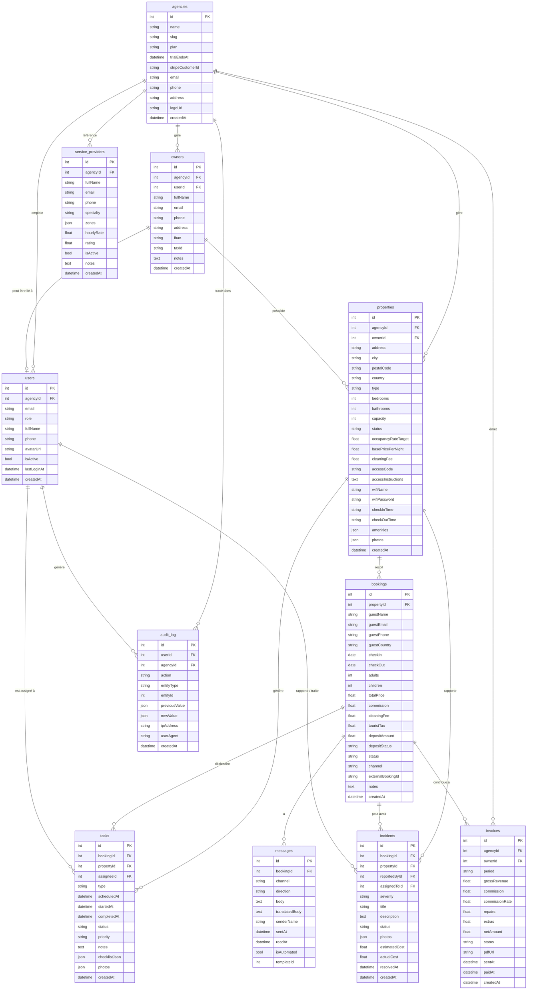

# ConciergeOS — Schéma de Base de Données (ERD)

> Documentation technique du modèle de données de la plateforme SaaS ConciergeOS.  
> Compatibilité : SQLite (développement) · PostgreSQL / Supabase (production)

---

## 1. Vue d'ensemble

ConciergeOS repose sur **11 tables** organisées autour de deux axes principaux :

- **Axe propriété** : `agencies → owners → properties → bookings`
- **Axe opérations** : `tasks · incidents · messages · service_providers`

Et deux tables transverses :
- `invoices` — facturation et reversements propriétaires
- `audit_log` — traçabilité complète des actions

### Règles générales

| Règle | SQLite | PostgreSQL |
|---|---|---|
| Clé primaire | `INTEGER PRIMARY KEY AUTOINCREMENT` | `SERIAL PRIMARY KEY` ou `UUID DEFAULT gen_random_uuid()` |
| Timestamps | `TEXT` (ISO 8601) | `TIMESTAMPTZ` |
| JSON | `TEXT` (stocké comme JSON) | `JSONB` (indexable, validé) |
| Booléens | `INTEGER` (0/1) | `BOOLEAN` |
| Enum | `TEXT` + CHECK constraint | `TEXT` + CHECK ou type `ENUM` personnalisé |

**Toutes les tables critiques** disposent d'une colonne `createdAt` pour l'audit temporel.

**Multi-tenant** : chaque table métier contient une colonne `agencyId` (directement ou par jointure) permettant l'isolation des données entre agences clientes.

---

## 2. Diagramme ERD (Mermaid)



---

## 3. Définition complète des tables

---

### 3.1 `agencies` — Agences clientes de la plateforme

**Description :** Table racine du modèle multi-tenant. Chaque agence de conciergerie souscrit un plan SaaS et dispose d'un espace isolé. Toutes les autres tables y sont rattachées directement ou indirectement via `agencyId`.

#### Schéma SQL

```sql
-- ============================================================
-- TABLE : agencies
-- Description : Agences clientes de la plateforme ConciergeOS
-- ============================================================

-- SQLite
CREATE TABLE agencies (
    id              INTEGER PRIMARY KEY AUTOINCREMENT,
    name            TEXT NOT NULL,
    slug            TEXT NOT NULL UNIQUE,               -- identifiant URL ex: "villa-azur-nice"
    plan            TEXT NOT NULL DEFAULT 'freemium'    -- freemium | starter | pro | agency
                    CHECK (plan IN ('freemium','starter','pro','agency')),
    trialEndsAt     TEXT,                               -- ISO 8601, NULL si hors essai
    stripeCustomerId TEXT UNIQUE,                       -- ID client Stripe ex: "cus_Xyz123"
    email           TEXT NOT NULL,
    phone           TEXT,
    address         TEXT,
    logoUrl         TEXT,
    createdAt       TEXT NOT NULL DEFAULT (datetime('now'))
);

-- PostgreSQL / Supabase
CREATE TABLE agencies (
    id                SERIAL PRIMARY KEY,
    name              VARCHAR(255) NOT NULL,
    slug              VARCHAR(100) NOT NULL UNIQUE,
    plan              TEXT NOT NULL DEFAULT 'freemium'
                      CHECK (plan IN ('freemium','starter','pro','agency')),
    "trialEndsAt"     TIMESTAMPTZ,
    "stripeCustomerId" VARCHAR(100) UNIQUE,
    email             VARCHAR(255) NOT NULL,
    phone             VARCHAR(50),
    address           TEXT,
    "logoUrl"         TEXT,
    "createdAt"       TIMESTAMPTZ NOT NULL DEFAULT NOW()
);

COMMENT ON TABLE agencies IS 'Agences clientes de la plateforme SaaS ConciergeOS';
COMMENT ON COLUMN agencies.slug IS 'Identifiant URL unique, ex: villa-azur-nice';
COMMENT ON COLUMN agencies.plan IS 'Plan tarifaire souscrit : freemium, starter, pro, agency';
COMMENT ON COLUMN agencies."trialEndsAt" IS 'Date de fin d''essai gratuit. NULL = abonnement actif ou expiré';
COMMENT ON COLUMN agencies."stripeCustomerId" IS 'Référence client dans Stripe, pour facturation SaaS';
```

#### Index

```sql
CREATE UNIQUE INDEX idx_agencies_slug ON agencies(slug);
CREATE INDEX idx_agencies_plan ON agencies(plan);
-- Requête typique : filtrer les agences en période d'essai (tableau de bord admin)
CREATE INDEX idx_agencies_trial ON agencies("trialEndsAt") WHERE "trialEndsAt" IS NOT NULL;
```

#### Colonnes détaillées

| Colonne | Type | Nullable | Exemple | Signification métier |
|---|---|---|---|---|
| `id` | INTEGER / SERIAL | Non | `42` | Identifiant technique interne |
| `name` | TEXT | Non | `"Villa Azur Conciergerie"` | Raison sociale ou nom commercial |
| `slug` | TEXT | Non | `"villa-azur-nice"` | Identifiant URL, utilisé dans les sous-domaines et l'API |
| `plan` | TEXT | Non | `"pro"` | Détermine les quotas (nb biens, users, fonctionnalités) |
| `trialEndsAt` | DATETIME | Oui | `"2026-06-30T23:59:59Z"` | NULL = pas d'essai en cours |
| `stripeCustomerId` | TEXT | Oui | `"cus_NxK8..."` | Lien vers le compte Stripe pour les paiements SaaS |
| `email` | TEXT | Non | `"contact@villa-azur.fr"` | Email de contact principal de l'agence |
| `phone` | TEXT | Oui | `"+33612345678"` | Téléphone de l'agence |
| `address` | TEXT | Oui | `"12 rue de la Mer, 06000 Nice"` | Adresse postale |
| `logoUrl` | TEXT | Oui | `"https://cdn.../logo.png"` | Logo affiché dans l'interface et les PDFs |
| `createdAt` | DATETIME | Non | `"2026-01-15T10:00:00Z"` | Date d'inscription de l'agence |

#### Règles métier

- Le `slug` est généré automatiquement à partir du `name` lors de la création (slugify). Il ne peut plus être modifié ensuite.
- Le passage de `freemium` à un plan payant est déclenché par Stripe webhook → mise à jour du `plan`.
- Si `trialEndsAt` est dans le passé et qu'aucun paiement n'est actif, l'accès est basculé en mode lecture seule.
- Un `stripeCustomerId` NULL indique une agence en essai gratuit ou un abonnement géré manuellement.

---

### 3.2 `users` — Utilisateurs connectés

**Description :** Tous les comptes pouvant se connecter à la plateforme. Un utilisateur appartient à une agence (sauf le `super_admin` plateforme). Le rôle détermine les permissions via RBAC.

#### Schéma SQL

```sql
-- SQLite
CREATE TABLE users (
    id            INTEGER PRIMARY KEY AUTOINCREMENT,
    agencyId      INTEGER NOT NULL REFERENCES agencies(id) ON DELETE RESTRICT,
    email         TEXT NOT NULL UNIQUE,
    role          TEXT NOT NULL DEFAULT 'manager'
                  CHECK (role IN ('super_admin','admin','manager','commercial','provider','owner','guest')),
    fullName      TEXT NOT NULL,
    phone         TEXT,
    avatarUrl     TEXT,
    isActive      INTEGER NOT NULL DEFAULT 1,      -- 0 = désactivé
    lastLoginAt   TEXT,
    createdAt     TEXT NOT NULL DEFAULT (datetime('now'))
);

-- PostgreSQL / Supabase
CREATE TABLE users (
    id            SERIAL PRIMARY KEY,
    "agencyId"    INTEGER NOT NULL REFERENCES agencies(id) ON DELETE RESTRICT,
    email         VARCHAR(255) NOT NULL UNIQUE,
    role          TEXT NOT NULL DEFAULT 'manager'
                  CHECK (role IN ('super_admin','admin','manager','commercial','provider','owner','guest')),
    "fullName"    VARCHAR(255) NOT NULL,
    phone         VARCHAR(50),
    "avatarUrl"   TEXT,
    "isActive"    BOOLEAN NOT NULL DEFAULT TRUE,
    "lastLoginAt" TIMESTAMPTZ,
    "createdAt"   TIMESTAMPTZ NOT NULL DEFAULT NOW()
);

COMMENT ON COLUMN users.role IS 'Hiérarchie: super_admin > admin > manager > commercial > provider/owner/guest';
COMMENT ON COLUMN users."isActive" IS 'FALSE = compte désactivé, login impossible mais données conservées';
```

#### Index

```sql
CREATE UNIQUE INDEX idx_users_email ON users(email);
CREATE INDEX idx_users_agency_role ON users("agencyId", role);
-- Recherche des prestataires actifs d'une agence (assignation de tâches)
CREATE INDEX idx_users_agency_active ON users("agencyId", "isActive") WHERE "isActive" = TRUE;
```

#### Rôles et permissions

| Rôle | Description | Périmètre |
|---|---|---|
| `super_admin` | Admin plateforme ConciergeOS | Toutes les agences |
| `admin` | Responsable de l'agence | Son agence complète |
| `manager` | Gestionnaire opérationnel | Biens assignés |
| `commercial` | Suivi réservations et revenus | Lecture sur les biens |
| `provider` | Prestataire (ménage, maintenance) | Ses tâches uniquement |
| `owner` | Propriétaire avec portail | Ses biens uniquement |
| `guest` | Voyageur (accès limité) | Sa réservation |

#### Colonnes détaillées

| Colonne | Type | Nullable | Exemple | Signification métier |
|---|---|---|---|---|
| `id` | INTEGER | Non | `7` | Identifiant utilisateur |
| `agencyId` | INTEGER | Non | `42` | Rattachement à l'agence |
| `email` | TEXT | Non | `"marie@villa-azur.fr"` | Login et communication |
| `role` | TEXT | Non | `"manager"` | Détermine les droits d'accès (RBAC) |
| `fullName` | TEXT | Non | `"Marie Dupont"` | Nom affiché dans l'interface |
| `phone` | TEXT | Oui | `"+33611223344"` | Contact mobile |
| `avatarUrl` | TEXT | Oui | `"https://cdn.../avatar.jpg"` | Photo de profil |
| `isActive` | BOOL | Non | `true` | Permet de désactiver sans supprimer |
| `lastLoginAt` | DATETIME | Oui | `"2026-05-10T08:30:00Z"` | Suivi d'activité, détection d'inactivité |
| `createdAt` | DATETIME | Non | `"2026-01-20T09:00:00Z"` | Date de création du compte |

#### Règles métier

- Un `super_admin` peut appartenir à n'importe quelle agence (ou à une agence interne ConciergeOS).
- La désactivation (`isActive = false`) est préférable à la suppression pour conserver l'historique des tâches et audits.
- Le `lastLoginAt` est mis à jour à chaque connexion via le middleware d'authentification.
- L'email est unique globalement (pas par agence) : un utilisateur ne peut avoir qu'un seul compte.

---

### 3.3 `owners` — Propriétaires immobiliers

**Description :** Personnes physiques ou morales propriétaires des biens gérés par l'agence. Un propriétaire peut optionnellement avoir un accès portail (dans ce cas, `userId` est renseigné). Cette séparation permet de gérer des propriétaires qui n'ont pas de compte utilisateur (contacts externes).

#### Schéma SQL

```sql
-- SQLite
CREATE TABLE owners (
    id          INTEGER PRIMARY KEY AUTOINCREMENT,
    agencyId    INTEGER NOT NULL REFERENCES agencies(id) ON DELETE RESTRICT,
    userId      INTEGER REFERENCES users(id) ON DELETE SET NULL,   -- optionnel : accès portail
    fullName    TEXT NOT NULL,
    email       TEXT,
    phone       TEXT,
    address     TEXT,
    iban        TEXT,                    -- pour reversements automatiques
    taxId       TEXT,                    -- SIRET / numéro fiscal
    notes       TEXT,
    createdAt   TEXT NOT NULL DEFAULT (datetime('now'))
);

-- PostgreSQL / Supabase
CREATE TABLE owners (
    id          SERIAL PRIMARY KEY,
    "agencyId"  INTEGER NOT NULL REFERENCES agencies(id) ON DELETE RESTRICT,
    "userId"    INTEGER REFERENCES users(id) ON DELETE SET NULL,
    "fullName"  VARCHAR(255) NOT NULL,
    email       VARCHAR(255),
    phone       VARCHAR(50),
    address     TEXT,
    iban        VARCHAR(34),             -- IBAN max 34 caractères (norme ISO 13616)
    "taxId"     VARCHAR(50),
    notes       TEXT,
    "createdAt" TIMESTAMPTZ NOT NULL DEFAULT NOW()
);

COMMENT ON COLUMN owners.iban IS 'IBAN pour les virements de reversement mensuel. Stocker chiffré en production.';
COMMENT ON COLUMN owners."taxId" IS 'SIRET (France) ou équivalent étranger. Obligatoire pour les factures.';
COMMENT ON COLUMN owners."userId" IS 'Lien optionnel vers users : si le proprio dispose d''un portail de suivi';
```

#### Index

```sql
CREATE INDEX idx_owners_agency ON owners("agencyId");
CREATE INDEX idx_owners_user ON owners("userId") WHERE "userId" IS NOT NULL;
-- Recherche par email pour déduplication lors de l'import
CREATE INDEX idx_owners_email ON owners(email) WHERE email IS NOT NULL;
```

#### Règles métier

- L'IBAN doit être stocké **chiffré** (AES-256 ou via Supabase Vault) — jamais en clair en base de production.
- Si `userId` est renseigné, le propriétaire peut se connecter et voir le tableau de bord de ses biens (revenus, taux d'occupation, calendrier).
- Un propriétaire peut posséder plusieurs biens (`owners ||--o{ properties`).
- La suppression d'un owner est bloquée (`RESTRICT`) s'il possède encore des biens actifs.

---

### 3.4 `properties` — Biens immobiliers gérés

**Description :** Cœur du produit. Chaque bien représente un logement géré par l'agence. Contient toutes les informations opérationnelles (accès, équipements, tarifs) et les paramètres de paramétrage du bien.

#### Schéma SQL

```sql
-- SQLite
CREATE TABLE properties (
    id                    INTEGER PRIMARY KEY AUTOINCREMENT,
    agencyId              INTEGER NOT NULL REFERENCES agencies(id) ON DELETE RESTRICT,
    ownerId               INTEGER NOT NULL REFERENCES owners(id) ON DELETE RESTRICT,
    address               TEXT NOT NULL,
    city                  TEXT NOT NULL,
    postalCode            TEXT NOT NULL,
    country               TEXT NOT NULL DEFAULT 'FR',
    type                  TEXT NOT NULL DEFAULT 'apartment'
                          CHECK (type IN ('apartment','house','villa','studio')),
    bedrooms              INTEGER NOT NULL DEFAULT 1,
    bathrooms             INTEGER NOT NULL DEFAULT 1,
    capacity              INTEGER NOT NULL DEFAULT 2,     -- nb de voyageurs max
    status                TEXT NOT NULL DEFAULT 'draft'
                          CHECK (status IN ('active','inactive','pending','draft')),
    occupancyRateTarget   REAL,                           -- % cible ex: 0.75
    basePricePerNight     REAL NOT NULL DEFAULT 0,
    cleaningFee           REAL NOT NULL DEFAULT 0,
    accessCode            TEXT,                           -- code boîte à clés ou digicode
    accessInstructions    TEXT,                           -- instructions complètes d'accès
    wifiName              TEXT,
    wifiPassword          TEXT,
    checkInTime           TEXT DEFAULT '16:00',           -- heure locale HH:MM
    checkOutTime          TEXT DEFAULT '11:00',
    amenities             TEXT DEFAULT '[]',              -- JSON array ex: ["wifi","parking","pool"]
    photos                TEXT DEFAULT '[]',              -- JSON array d'URLs
    createdAt             TEXT NOT NULL DEFAULT (datetime('now'))
);

-- PostgreSQL / Supabase
CREATE TABLE properties (
    id                      SERIAL PRIMARY KEY,
    "agencyId"              INTEGER NOT NULL REFERENCES agencies(id) ON DELETE RESTRICT,
    "ownerId"               INTEGER NOT NULL REFERENCES owners(id) ON DELETE RESTRICT,
    address                 VARCHAR(255) NOT NULL,
    city                    VARCHAR(100) NOT NULL,
    "postalCode"            VARCHAR(20) NOT NULL,
    country                 VARCHAR(10) NOT NULL DEFAULT 'FR',
    type                    TEXT NOT NULL DEFAULT 'apartment'
                            CHECK (type IN ('apartment','house','villa','studio')),
    bedrooms                SMALLINT NOT NULL DEFAULT 1 CHECK (bedrooms >= 0),
    bathrooms               SMALLINT NOT NULL DEFAULT 1 CHECK (bathrooms >= 0),
    capacity                SMALLINT NOT NULL DEFAULT 2 CHECK (capacity >= 1),
    status                  TEXT NOT NULL DEFAULT 'draft'
                            CHECK (status IN ('active','inactive','pending','draft')),
    "occupancyRateTarget"   NUMERIC(4,3) CHECK ("occupancyRateTarget" BETWEEN 0 AND 1),
    "basePricePerNight"     NUMERIC(10,2) NOT NULL DEFAULT 0,
    "cleaningFee"           NUMERIC(10,2) NOT NULL DEFAULT 0,
    "accessCode"            VARCHAR(50),
    "accessInstructions"    TEXT,
    "wifiName"              VARCHAR(100),
    "wifiPassword"          VARCHAR(100),
    "checkInTime"           TIME DEFAULT '16:00',
    "checkOutTime"          TIME DEFAULT '11:00',
    amenities               JSONB NOT NULL DEFAULT '[]',
    photos                  JSONB NOT NULL DEFAULT '[]',
    "createdAt"             TIMESTAMPTZ NOT NULL DEFAULT NOW()
);

COMMENT ON COLUMN properties.status IS 'draft=en configuration, pending=en attente validation, active=commercialisé, inactive=hors ligne';
COMMENT ON COLUMN properties."occupancyRateTarget" IS 'Taux d''occupation cible entre 0 et 1. Utilisé pour les alertes revenue management.';
COMMENT ON COLUMN properties."accessCode" IS 'Code d''accès physique. Chiffrer en production.';
COMMENT ON COLUMN properties.amenities IS 'Liste JSON des équipements: ["wifi","parking","pool","jacuzzi","pet_friendly"]';
```

#### Index

```sql
CREATE INDEX idx_properties_agency ON properties("agencyId");
CREATE INDEX idx_properties_owner ON properties("ownerId");
CREATE INDEX idx_properties_city ON properties(city);
CREATE INDEX idx_properties_status ON properties(status);
-- Recherche géographique par code postal (assignation prestataires)
CREATE INDEX idx_properties_postal ON properties("postalCode");
-- Index partiel : biens actifs uniquement (requête la plus fréquente)
CREATE INDEX idx_properties_active ON properties("agencyId", status) WHERE status = 'active';
```

#### Colonnes détaillées

| Colonne | Type | Nullable | Exemple | Signification métier |
|---|---|---|---|---|
| `type` | TEXT | Non | `"villa"` | Catégorie du bien, influe sur les templates de checklist |
| `status` | TEXT | Non | `"active"` | Cycle de vie du bien dans la plateforme |
| `occupancyRateTarget` | REAL | Oui | `0.75` | Objectif 75% d'occupation, seuil pour alertes |
| `basePricePerNight` | REAL | Non | `120.00` | Tarif de référence avant règles dynamiques |
| `cleaningFee` | REAL | Non | `45.00` | Frais de ménage appliqués à chaque réservation |
| `accessCode` | TEXT | Oui | `"1234#"` | Code boîte à clés ou digicode — chiffrer ! |
| `checkInTime` | TIME | Non | `"16:00"` | Heure minimale d'arrivée des voyageurs |
| `checkOutTime` | TIME | Non | `"11:00"` | Heure limite de départ des voyageurs |
| `amenities` | JSON | Non | `["wifi","pool"]` | Équipements disponibles pour filtrage et affichage |
| `photos` | JSON | Non | `["https://...jpg"]` | URLs des photos (CDN externe) |

#### Règles métier

- Un bien en statut `draft` n'est pas visible sur les canaux et ne peut pas recevoir de réservation.
- La modification de `accessCode` et `wifiPassword` doit être tracée dans `audit_log`.
- Le `cleaningFee` de la table properties est la valeur par défaut ; il peut être surchargé au niveau de chaque réservation.

---

### 3.5 `bookings` — Réservations

**Description :** Table centrale des opérations quotidiennes. Chaque réservation déclenche une cascade d'opérations : création de tâches de ménage/check-in/check-out, suivi des paiements, messagerie voyageur.

#### Schéma SQL

```sql
-- SQLite
CREATE TABLE bookings (
    id                INTEGER PRIMARY KEY AUTOINCREMENT,
    propertyId        INTEGER NOT NULL REFERENCES properties(id) ON DELETE RESTRICT,
    guestName         TEXT NOT NULL,
    guestEmail        TEXT,
    guestPhone        TEXT,
    guestCountry      TEXT,                    -- code ISO ex: "FR", "DE", "GB"
    checkIn           TEXT NOT NULL,           -- date ISO YYYY-MM-DD
    checkOut          TEXT NOT NULL,           -- date ISO YYYY-MM-DD
    adults            INTEGER NOT NULL DEFAULT 1,
    children          INTEGER NOT NULL DEFAULT 0,
    totalPrice        REAL NOT NULL DEFAULT 0,
    commission        REAL NOT NULL DEFAULT 0, -- commission agence en €
    cleaningFee       REAL NOT NULL DEFAULT 0,
    touristTax        REAL NOT NULL DEFAULT 0, -- taxe de séjour en €
    depositAmount     REAL NOT NULL DEFAULT 0,
    depositStatus     TEXT NOT NULL DEFAULT 'pending'
                      CHECK (depositStatus IN ('pending','captured','released','deducted')),
    status            TEXT NOT NULL DEFAULT 'pending'
                      CHECK (status IN ('pending','confirmed','checked_in','checked_out','cancelled','no_show')),
    channel           TEXT NOT NULL DEFAULT 'direct'
                      CHECK (channel IN ('airbnb','booking','vrbo','direct')),
    externalBookingId TEXT,                    -- ID Airbnb/Booking.com
    notes             TEXT,
    createdAt         TEXT NOT NULL DEFAULT (datetime('now'))
);

-- PostgreSQL / Supabase
CREATE TABLE bookings (
    id                  SERIAL PRIMARY KEY,
    "propertyId"        INTEGER NOT NULL REFERENCES properties(id) ON DELETE RESTRICT,
    "guestName"         VARCHAR(255) NOT NULL,
    "guestEmail"        VARCHAR(255),
    "guestPhone"        VARCHAR(50),
    "guestCountry"      CHAR(2),
    "checkIn"           DATE NOT NULL,
    "checkOut"          DATE NOT NULL,
    adults              SMALLINT NOT NULL DEFAULT 1 CHECK (adults >= 1),
    children            SMALLINT NOT NULL DEFAULT 0 CHECK (children >= 0),
    "totalPrice"        NUMERIC(10,2) NOT NULL DEFAULT 0,
    commission          NUMERIC(10,2) NOT NULL DEFAULT 0,
    "cleaningFee"       NUMERIC(10,2) NOT NULL DEFAULT 0,
    "touristTax"        NUMERIC(10,2) NOT NULL DEFAULT 0,
    "depositAmount"     NUMERIC(10,2) NOT NULL DEFAULT 0,
    "depositStatus"     TEXT NOT NULL DEFAULT 'pending'
                        CHECK ("depositStatus" IN ('pending','captured','released','deducted')),
    status              TEXT NOT NULL DEFAULT 'pending'
                        CHECK (status IN ('pending','confirmed','checked_in','checked_out','cancelled','no_show')),
    channel             TEXT NOT NULL DEFAULT 'direct'
                        CHECK (channel IN ('airbnb','booking','vrbo','direct')),
    "externalBookingId" VARCHAR(100),
    notes               TEXT,
    "createdAt"         TIMESTAMPTZ NOT NULL DEFAULT NOW(),
    -- Contrainte : checkOut doit être après checkIn
    CONSTRAINT chk_dates CHECK ("checkOut" > "checkIn"),
    -- Contrainte : pas de doublon sur une même réservation externe
    CONSTRAINT uq_external_booking UNIQUE (channel, "externalBookingId")
);

COMMENT ON COLUMN bookings."depositStatus" IS 'pending=caution non encaissée, captured=encaissée, released=libérée, deducted=déduite pour dégâts';
COMMENT ON COLUMN bookings.channel IS 'Canal d''origine de la réservation';
COMMENT ON COLUMN bookings."externalBookingId" IS 'Référence de la réservation sur la plateforme OTA (ex: HM1234567890 sur Airbnb)';
```

#### Index

```sql
CREATE INDEX idx_bookings_property ON bookings("propertyId");
CREATE INDEX idx_bookings_checkin ON bookings("checkIn");
CREATE INDEX idx_bookings_checkout ON bookings("checkOut");
CREATE INDEX idx_bookings_status ON bookings(status);
CREATE INDEX idx_bookings_channel ON bookings(channel);
-- Recherche des réservations en cours (vue dashboard)
CREATE INDEX idx_bookings_active ON bookings("propertyId", status, "checkIn", "checkOut")
    WHERE status IN ('confirmed','checked_in');
-- Détection de surbooking : chevauchement de dates
CREATE INDEX idx_bookings_dates_property ON bookings("propertyId", "checkIn", "checkOut");
```

#### Règles métier

- **Anti-surbooking** : avant d'insérer une réservation, vérifier l'absence de chevauchement sur le même `propertyId` avec un statut actif (`confirmed`, `checked_in`).
- À la confirmation, le système crée automatiquement 3 tâches :
  1. `cleaning` avant `checkIn`
  2. `checkin` à `checkIn`
  3. `checkout` à `checkOut`
- Le `commission` est calculé comme `totalPrice × commissionRate` de l'agence.
- La `touristTax` est calculée selon la ville et le nombre de nuitées × nombre de voyageurs.
- Un statut `no_show` gèle la caution jusqu'à décision manuelle.

---

### 3.6 `tasks` — Missions opérationnelles

**Description :** Représente toutes les missions terrain : ménages, check-ins, check-outs, maintenances, inspections. Les tâches peuvent être générées automatiquement par les réservations ou créées manuellement.

#### Schéma SQL

```sql
-- SQLite
CREATE TABLE tasks (
    id            INTEGER PRIMARY KEY AUTOINCREMENT,
    bookingId     INTEGER REFERENCES bookings(id) ON DELETE SET NULL,     -- nullable : tâche hors réservation
    propertyId    INTEGER NOT NULL REFERENCES properties(id) ON DELETE RESTRICT,
    assigneeId    INTEGER REFERENCES users(id) ON DELETE SET NULL,         -- prestataire assigné
    type          TEXT NOT NULL
                  CHECK (type IN ('cleaning','checkin','checkout','maintenance','inspection')),
    scheduledAt   TEXT NOT NULL,           -- datetime prévue
    startedAt     TEXT,                    -- début effectif
    completedAt   TEXT,                    -- fin effective
    status        TEXT NOT NULL DEFAULT 'todo'
                  CHECK (status IN ('todo','in_progress','done','late','cancelled')),
    priority      TEXT NOT NULL DEFAULT 'normal'
                  CHECK (priority IN ('urgent','high','normal','low')),
    notes         TEXT,
    checklistJson TEXT DEFAULT '[]',       -- JSON array de {item, done, comment}
    photos        TEXT DEFAULT '[]',       -- JSON array d'URLs (photos avant/après)
    createdAt     TEXT NOT NULL DEFAULT (datetime('now'))
);

-- PostgreSQL / Supabase
CREATE TABLE tasks (
    id              SERIAL PRIMARY KEY,
    "bookingId"     INTEGER REFERENCES bookings(id) ON DELETE SET NULL,
    "propertyId"    INTEGER NOT NULL REFERENCES properties(id) ON DELETE RESTRICT,
    "assigneeId"    INTEGER REFERENCES users(id) ON DELETE SET NULL,
    type            TEXT NOT NULL
                    CHECK (type IN ('cleaning','checkin','checkout','maintenance','inspection')),
    "scheduledAt"   TIMESTAMPTZ NOT NULL,
    "startedAt"     TIMESTAMPTZ,
    "completedAt"   TIMESTAMPTZ,
    status          TEXT NOT NULL DEFAULT 'todo'
                    CHECK (status IN ('todo','in_progress','done','late','cancelled')),
    priority        TEXT NOT NULL DEFAULT 'normal'
                    CHECK (priority IN ('urgent','high','normal','low')),
    notes           TEXT,
    "checklistJson" JSONB NOT NULL DEFAULT '[]',
    photos          JSONB NOT NULL DEFAULT '[]',
    "createdAt"     TIMESTAMPTZ NOT NULL DEFAULT NOW()
);

COMMENT ON COLUMN tasks.type IS 'cleaning=ménage, checkin=accueil voyageur, checkout=départ, maintenance=réparation, inspection=contrôle';
COMMENT ON COLUMN tasks."checklistJson" IS 'Ex: [{"item":"Changer literie","done":true,"comment":""},{"item":"Vérifier WiFi","done":false,"comment":"Router redémarré"}]';
COMMENT ON COLUMN tasks.photos IS 'URLs photos avant/après intervention, uploadées depuis l''app mobile';
```

#### Index

```sql
CREATE INDEX idx_tasks_property ON tasks("propertyId");
CREATE INDEX idx_tasks_booking ON tasks("bookingId") WHERE "bookingId" IS NOT NULL;
CREATE INDEX idx_tasks_assignee ON tasks("assigneeId") WHERE "assigneeId" IS NOT NULL;
CREATE INDEX idx_tasks_scheduled ON tasks("scheduledAt");
CREATE INDEX idx_tasks_status ON tasks(status);
-- Vue planning du jour : tâches à faire aujourd'hui par prestataire
CREATE INDEX idx_tasks_planning ON tasks("assigneeId", status, "scheduledAt")
    WHERE status IN ('todo','in_progress');
```

#### Règles métier

- Une tâche devient `late` automatiquement si son `scheduledAt` est dépassé et son statut est encore `todo` ou `in_progress` (job CRON toutes les 15 minutes).
- La checklist est initialisée depuis un template selon le `type` de tâche et le `type` de bien.
- Les `photos` sont obligatoires pour valider une tâche de type `checkout` (état des lieux sortant).
- Si `assigneeId` est NULL, la tâche est dans le "pool" non assigné et visible par tous les managers.

---

### 3.7 `incidents` — Incidents et tickets

**Description :** Signalement et suivi de tout problème constaté sur un bien : dégradation, panne équipement, problème voyageur, sinistre. Permet le suivi des coûts de réparation et leur déduction sur les reversements.

#### Schéma SQL

```sql
-- SQLite
CREATE TABLE incidents (
    id              INTEGER PRIMARY KEY AUTOINCREMENT,
    bookingId       INTEGER REFERENCES bookings(id) ON DELETE SET NULL,
    propertyId      INTEGER NOT NULL REFERENCES properties(id) ON DELETE RESTRICT,
    reportedById    INTEGER NOT NULL REFERENCES users(id) ON DELETE RESTRICT,
    assignedToId    INTEGER REFERENCES users(id) ON DELETE SET NULL,
    severity        TEXT NOT NULL DEFAULT 'normal'
                    CHECK (severity IN ('urgent','important','normal')),
    title           TEXT NOT NULL,
    description     TEXT,
    status          TEXT NOT NULL DEFAULT 'open'
                    CHECK (status IN ('open','in_progress','resolved','closed')),
    photos          TEXT DEFAULT '[]',
    estimatedCost   REAL,
    actualCost      REAL,
    resolvedAt      TEXT,
    createdAt       TEXT NOT NULL DEFAULT (datetime('now'))
);

-- PostgreSQL / Supabase
CREATE TABLE incidents (
    id              SERIAL PRIMARY KEY,
    "bookingId"     INTEGER REFERENCES bookings(id) ON DELETE SET NULL,
    "propertyId"    INTEGER NOT NULL REFERENCES properties(id) ON DELETE RESTRICT,
    "reportedById"  INTEGER NOT NULL REFERENCES users(id) ON DELETE RESTRICT,
    "assignedToId"  INTEGER REFERENCES users(id) ON DELETE SET NULL,
    severity        TEXT NOT NULL DEFAULT 'normal'
                    CHECK (severity IN ('urgent','important','normal')),
    title           VARCHAR(255) NOT NULL,
    description     TEXT,
    status          TEXT NOT NULL DEFAULT 'open'
                    CHECK (status IN ('open','in_progress','resolved','closed')),
    photos          JSONB NOT NULL DEFAULT '[]',
    "estimatedCost" NUMERIC(10,2),
    "actualCost"    NUMERIC(10,2),
    "resolvedAt"    TIMESTAMPTZ,
    "createdAt"     TIMESTAMPTZ NOT NULL DEFAULT NOW()
);

COMMENT ON COLUMN incidents.severity IS 'urgent=intervention immédiate requise (ex: dégât des eaux), important=sous 24h, normal=planifiable';
COMMENT ON COLUMN incidents."estimatedCost" IS 'Devis estimatif avant intervention';
COMMENT ON COLUMN incidents."actualCost" IS 'Coût réel après facture prestataire. Peut être déduit du reversement owner.';
```

#### Index

```sql
CREATE INDEX idx_incidents_property ON incidents("propertyId");
CREATE INDEX idx_incidents_booking ON incidents("bookingId") WHERE "bookingId" IS NOT NULL;
CREATE INDEX idx_incidents_status ON incidents(status);
CREATE INDEX idx_incidents_severity ON incidents(severity);
-- Incidents ouverts urgents (tableau de bord manager)
CREATE INDEX idx_incidents_urgent ON incidents("propertyId", severity, status)
    WHERE status IN ('open','in_progress') AND severity = 'urgent';
```

#### Règles métier

- Un incident `urgent` déclenche une notification push/SMS immédiate au manager responsable du bien.
- L'`actualCost` est automatiquement proposé en déduction sur la prochaine facture de reversement du propriétaire.
- Si lié à une `bookingId`, le voyageur peut être tenu responsable et la caution (`depositStatus = deducted`) peut être activée.
- La résolution (`status = resolved`) nécessite au moins une photo dans `photos`.

---

### 3.8 `messages` — Messagerie unifiée

**Description :** Centralise tous les échanges avec les voyageurs, quelle que soit la plateforme (Airbnb, Booking.com, email, SMS, WhatsApp). Permet un historique unifié et la gestion des messages automatiques.

#### Schéma SQL

```sql
-- SQLite
CREATE TABLE messages (
    id              INTEGER PRIMARY KEY AUTOINCREMENT,
    bookingId       INTEGER NOT NULL REFERENCES bookings(id) ON DELETE CASCADE,
    channel         TEXT NOT NULL
                    CHECK (channel IN ('airbnb','booking','email','sms','whatsapp','internal')),
    direction       TEXT NOT NULL
                    CHECK (direction IN ('inbound','outbound')),
    body            TEXT NOT NULL,
    translatedBody  TEXT,                  -- traduction automatique si langue étrangère
    senderName      TEXT,
    sentAt          TEXT NOT NULL DEFAULT (datetime('now')),
    readAt          TEXT,
    isAutomated     INTEGER NOT NULL DEFAULT 0,
    templateId      INTEGER                -- référence vers un template de message (table future)
);

-- PostgreSQL / Supabase
CREATE TABLE messages (
    id              SERIAL PRIMARY KEY,
    "bookingId"     INTEGER NOT NULL REFERENCES bookings(id) ON DELETE CASCADE,
    channel         TEXT NOT NULL
                    CHECK (channel IN ('airbnb','booking','email','sms','whatsapp','internal')),
    direction       TEXT NOT NULL CHECK (direction IN ('inbound','outbound')),
    body            TEXT NOT NULL,
    "translatedBody" TEXT,
    "senderName"    VARCHAR(255),
    "sentAt"        TIMESTAMPTZ NOT NULL DEFAULT NOW(),
    "readAt"        TIMESTAMPTZ,
    "isAutomated"   BOOLEAN NOT NULL DEFAULT FALSE,
    "templateId"    INTEGER
);

COMMENT ON COLUMN messages.direction IS 'inbound=message reçu du voyageur, outbound=message envoyé par l''agence/système';
COMMENT ON COLUMN messages."translatedBody" IS 'Traduction automatique (DeepL/OpenAI) si langue détectée différente du français';
COMMENT ON COLUMN messages."isAutomated" IS 'TRUE si envoyé par une règle d''automatisation (ex: message de bienvenue J-1)';
COMMENT ON COLUMN messages."templateId" IS 'Référence vers le template utilisé pour les messages automatiques';
```

#### Index

```sql
CREATE INDEX idx_messages_booking ON messages("bookingId");
CREATE INDEX idx_messages_channel ON messages(channel);
CREATE INDEX idx_messages_sent ON messages("sentAt");
-- Messages non lus (badge notification)
CREATE INDEX idx_messages_unread ON messages("bookingId", "readAt")
    WHERE "readAt" IS NULL AND direction = 'inbound';
```

#### Règles métier

- `ON DELETE CASCADE` sur `bookingId` : si une réservation est supprimée (cas rare), les messages sont supprimés avec elle.
- La traduction (`translatedBody`) est générée asynchroniquement et peut être NULL temporairement.
- Les messages `internal` sont des notes d'équipe invisibles au voyageur.
- Les messages automatiques (`isAutomated = true`) sont envoyés par le moteur de règles selon des triggers (J-2 avant check-in, J+1 après check-out pour demander un avis).

---

### 3.9 `invoices` — Factures et reversements propriétaires

**Description :** Factures mensuelles émises par l'agence à destination des propriétaires. Détaille les revenus bruts, la commission agence, les frais de réparation et le net à reverser.

#### Schéma SQL

```sql
-- SQLite
CREATE TABLE invoices (
    id              INTEGER PRIMARY KEY AUTOINCREMENT,
    agencyId        INTEGER NOT NULL REFERENCES agencies(id) ON DELETE RESTRICT,
    ownerId         INTEGER NOT NULL REFERENCES owners(id) ON DELETE RESTRICT,
    period          TEXT NOT NULL,             -- format YYYY-MM ex: "2026-05"
    grossRevenue    REAL NOT NULL DEFAULT 0,   -- total des réservations sur la période
    commission      REAL NOT NULL DEFAULT 0,   -- montant commission agence
    commissionRate  REAL NOT NULL DEFAULT 0,   -- taux ex: 0.20 pour 20%
    repairs         REAL NOT NULL DEFAULT 0,   -- coût des incidents déduits
    extras          REAL NOT NULL DEFAULT 0,   -- frais additionnels divers
    netAmount       REAL NOT NULL DEFAULT 0,   -- montant net à reverser au proprio
    status          TEXT NOT NULL DEFAULT 'draft'
                    CHECK (status IN ('draft','sent','paid','overdue')),
    pdfUrl          TEXT,
    sentAt          TEXT,
    paidAt          TEXT,
    createdAt       TEXT NOT NULL DEFAULT (datetime('now')),
    UNIQUE (ownerId, period)                   -- une seule facture par proprio par mois
);

-- PostgreSQL / Supabase
CREATE TABLE invoices (
    id                SERIAL PRIMARY KEY,
    "agencyId"        INTEGER NOT NULL REFERENCES agencies(id) ON DELETE RESTRICT,
    "ownerId"         INTEGER NOT NULL REFERENCES owners(id) ON DELETE RESTRICT,
    period            CHAR(7) NOT NULL,         -- YYYY-MM
    "grossRevenue"    NUMERIC(12,2) NOT NULL DEFAULT 0,
    commission        NUMERIC(12,2) NOT NULL DEFAULT 0,
    "commissionRate"  NUMERIC(4,3) NOT NULL DEFAULT 0,
    repairs           NUMERIC(12,2) NOT NULL DEFAULT 0,
    extras            NUMERIC(12,2) NOT NULL DEFAULT 0,
    "netAmount"       NUMERIC(12,2) NOT NULL DEFAULT 0,
    status            TEXT NOT NULL DEFAULT 'draft'
                      CHECK (status IN ('draft','sent','paid','overdue')),
    "pdfUrl"          TEXT,
    "sentAt"          TIMESTAMPTZ,
    "paidAt"          TIMESTAMPTZ,
    "createdAt"       TIMESTAMPTZ NOT NULL DEFAULT NOW(),
    UNIQUE ("ownerId", period)
);

COMMENT ON COLUMN invoices.period IS 'Période comptable au format YYYY-MM. Ex: 2026-05 pour mai 2026.';
COMMENT ON COLUMN invoices."netAmount" IS 'Calcul: grossRevenue - commission - repairs - extras. Montant viré au propriétaire.';
COMMENT ON COLUMN invoices."commissionRate" IS 'Taux de commission appliqué. Ex: 0.200 = 20%. Snapshot du taux au moment de la facturation.';
```

#### Index

```sql
CREATE INDEX idx_invoices_agency ON invoices("agencyId");
CREATE INDEX idx_invoices_owner ON invoices("ownerId");
CREATE INDEX idx_invoices_period ON invoices(period);
CREATE INDEX idx_invoices_status ON invoices(status);
-- Factures en retard (relances automatiques)
CREATE INDEX idx_invoices_overdue ON invoices(status, "sentAt")
    WHERE status IN ('sent','overdue');
```

#### Règles métier

- La contrainte `UNIQUE (ownerId, period)` garantit qu'une seule facture est générée par propriétaire par mois.
- `netAmount = grossRevenue - commission - repairs - extras`. Ce calcul est effectué à la génération et stocké (snapshot).
- Le `commissionRate` est snapshoté au moment de la création (le taux peut évoluer dans le temps).
- Le PDF est généré asynchroniquement et son URL stockée dans `pdfUrl`.
- Un job CRON change le statut de `sent` à `overdue` si `paidAt` est NULL 30 jours après `sentAt`.

---

### 3.10 `service_providers` — Prestataires externes

**Description :** Annuaire des prestataires terrain (sociétés de ménage, plombiers, électriciens, serruriers). Différent des `users` de type `provider` : un prestataire peut être une société sans accès à la plateforme.

#### Schéma SQL

```sql
-- SQLite
CREATE TABLE service_providers (
    id          INTEGER PRIMARY KEY AUTOINCREMENT,
    agencyId    INTEGER NOT NULL REFERENCES agencies(id) ON DELETE RESTRICT,
    fullName    TEXT NOT NULL,
    email       TEXT,
    phone       TEXT,
    specialty   TEXT NOT NULL
                CHECK (specialty IN ('cleaning','plumbing','electricity','locksmith','general')),
    zones       TEXT DEFAULT '[]',         -- JSON array de codes postaux ex: ["06000","06100"]
    hourlyRate  REAL,
    rating      REAL CHECK (rating BETWEEN 0 AND 5),
    isActive    INTEGER NOT NULL DEFAULT 1,
    notes       TEXT,
    createdAt   TEXT NOT NULL DEFAULT (datetime('now'))
);

-- PostgreSQL / Supabase
CREATE TABLE service_providers (
    id          SERIAL PRIMARY KEY,
    "agencyId"  INTEGER NOT NULL REFERENCES agencies(id) ON DELETE RESTRICT,
    "fullName"  VARCHAR(255) NOT NULL,
    email       VARCHAR(255),
    phone       VARCHAR(50),
    specialty   TEXT NOT NULL
                CHECK (specialty IN ('cleaning','plumbing','electricity','locksmith','general')),
    zones       JSONB NOT NULL DEFAULT '[]',
    "hourlyRate" NUMERIC(8,2),
    rating      NUMERIC(3,2) CHECK (rating BETWEEN 0 AND 5),
    "isActive"  BOOLEAN NOT NULL DEFAULT TRUE,
    notes       TEXT,
    "createdAt" TIMESTAMPTZ NOT NULL DEFAULT NOW()
);

COMMENT ON COLUMN service_providers.zones IS 'Liste de codes postaux couverts. Ex: ["06000","06100","06200"]. Utilisé pour l''assignation automatique.';
COMMENT ON COLUMN service_providers.rating IS 'Note moyenne calculée sur les interventions. Entre 0.00 et 5.00.';
COMMENT ON COLUMN service_providers.specialty IS 'Spécialité principale. Un prestataire general peut tout faire.';
```

#### Index

```sql
CREATE INDEX idx_providers_agency ON service_providers("agencyId");
CREATE INDEX idx_providers_specialty ON service_providers(specialty);
CREATE INDEX idx_providers_active ON service_providers("agencyId", "isActive") WHERE "isActive" = TRUE;
-- Index GIN pour recherche dans le tableau JSON des zones
CREATE INDEX idx_providers_zones ON service_providers USING GIN(zones);
```

#### Règles métier

- L'assignation automatique d'un prestataire à une tâche utilise : `specialty = type de tâche`, `zones @> postalCode du bien`, `isActive = true`, trié par `rating DESC`.
- Le `rating` est recalculé après chaque tâche complétée (moyenne glissante).
- Un prestataire `service_provider` peut aussi avoir un compte `users` avec le rôle `provider` pour accéder à l'app mobile.

---

### 3.11 `audit_log` — Journal d'audit

**Description :** Trace toutes les actions sensibles de la plateforme pour conformité RGPD, sécurité et débogage. Jamais modifiable ni supprimable par les utilisateurs.

#### Schéma SQL

```sql
-- SQLite
CREATE TABLE audit_log (
    id              INTEGER PRIMARY KEY AUTOINCREMENT,
    userId          INTEGER REFERENCES users(id) ON DELETE SET NULL,
    agencyId        INTEGER NOT NULL REFERENCES agencies(id) ON DELETE RESTRICT,
    action          TEXT NOT NULL,             -- ex: "booking.created", "user.role_changed"
    entityType      TEXT NOT NULL,             -- ex: "booking", "user", "property"
    entityId        INTEGER NOT NULL,
    previousValue   TEXT,                      -- JSON snapshot avant modification
    newValue        TEXT,                      -- JSON snapshot après modification
    ipAddress       TEXT,
    userAgent       TEXT,
    createdAt       TEXT NOT NULL DEFAULT (datetime('now'))
);

-- PostgreSQL / Supabase
CREATE TABLE audit_log (
    id              BIGSERIAL PRIMARY KEY,      -- BIGSERIAL : volume élevé attendu
    "userId"        INTEGER REFERENCES users(id) ON DELETE SET NULL,
    "agencyId"      INTEGER NOT NULL REFERENCES agencies(id) ON DELETE RESTRICT,
    action          VARCHAR(100) NOT NULL,
    "entityType"    VARCHAR(50) NOT NULL,
    "entityId"      INTEGER NOT NULL,
    "previousValue" JSONB,
    "newValue"      JSONB,
    "ipAddress"     INET,                       -- type natif PostgreSQL pour les IPs
    "userAgent"     TEXT,
    "createdAt"     TIMESTAMPTZ NOT NULL DEFAULT NOW()
);

COMMENT ON TABLE audit_log IS 'Journal d''audit immuable. Aucune UPDATE ni DELETE ne doit être permise sur cette table.';
COMMENT ON COLUMN audit_log.action IS 'Format: entité.verbe. Ex: booking.created, user.role_changed, property.access_code_viewed';
COMMENT ON COLUMN audit_log."ipAddress" IS 'Type INET PostgreSQL pour validation et indexation des adresses IP';
```

#### Index

```sql
CREATE INDEX idx_audit_agency ON audit_log("agencyId");
CREATE INDEX idx_audit_user ON audit_log("userId");
CREATE INDEX idx_audit_entity ON audit_log("entityType", "entityId");
CREATE INDEX idx_audit_action ON audit_log(action);
CREATE INDEX idx_audit_created ON audit_log("createdAt" DESC);
-- Recherche d'actions suspectes (tentatives de connexion, changements de rôle)
CREATE INDEX idx_audit_sensitive ON audit_log(action, "createdAt" DESC)
    WHERE action LIKE 'user.%' OR action LIKE 'agency.%';
```

#### Règles métier

- **Immuable** : aucun `UPDATE` ni `DELETE` n'est autorisé sur cette table. Implémenter via RLS (`USING (false)` pour UPDATE/DELETE) et permissions PostgreSQL.
- Actions à tracer obligatoirement : connexion, modification de rôle, accès au code d'accès, modification de tarif, génération/envoi de facture, modification de statut de caution.
- La table utilise `BIGSERIAL` car le volume peut atteindre plusieurs millions de lignes.
- Une politique de rétention de 2 ans est recommandée (archivage vers stockage froid).

---

## 4. Relations et intégrité référentielle

### Tableau des foreign keys

| Table source | Colonne FK | Table cible | Colonne | ON DELETE | Justification |
|---|---|---|---|---|---|
| `users` | `agencyId` | `agencies` | `id` | `RESTRICT` | Un user ne peut exister sans agence |
| `owners` | `agencyId` | `agencies` | `id` | `RESTRICT` | Un owner ne peut exister sans agence |
| `owners` | `userId` | `users` | `id` | `SET NULL` | La suppression du compte user ne supprime pas le proprio |
| `properties` | `agencyId` | `agencies` | `id` | `RESTRICT` | Un bien ne peut exister sans agence |
| `properties` | `ownerId` | `owners` | `id` | `RESTRICT` | Un bien sans propriétaire est incohérent |
| `bookings` | `propertyId` | `properties` | `id` | `RESTRICT` | Une réservation sans bien est invalide |
| `tasks` | `bookingId` | `bookings` | `id` | `SET NULL` | Une tâche de maintenance peut exister sans réservation |
| `tasks` | `propertyId` | `properties` | `id` | `RESTRICT` | Toute tâche est liée à un bien |
| `tasks` | `assigneeId` | `users` | `id` | `SET NULL` | Si l'user est supprimé, la tâche passe en non assignée |
| `incidents` | `bookingId` | `bookings` | `id` | `SET NULL` | Un incident peut exister sans réservation associée |
| `incidents` | `propertyId` | `properties` | `id` | `RESTRICT` | Tout incident est lié à un bien |
| `incidents` | `reportedById` | `users` | `id` | `RESTRICT` | On doit pouvoir identifier qui a signalé |
| `incidents` | `assignedToId` | `users` | `id` | `SET NULL` | L'assigné peut être désactivé |
| `messages` | `bookingId` | `bookings` | `id` | `CASCADE` | Un message n'a aucun sens sans sa réservation |
| `invoices` | `agencyId` | `agencies` | `id` | `RESTRICT` | Une facture sans agence est invalide |
| `invoices` | `ownerId` | `owners` | `id` | `RESTRICT` | Une facture sans destinataire est invalide |
| `service_providers` | `agencyId` | `agencies` | `id` | `RESTRICT` | Un prestataire appartient à une agence |
| `audit_log` | `userId` | `users` | `id` | `SET NULL` | Conserver les logs même si l'user est supprimé |
| `audit_log` | `agencyId` | `agencies` | `id` | `RESTRICT` | Le contexte agence est obligatoire pour l'audit |

### Règle générale : RESTRICT vs CASCADE vs SET NULL

| Comportement | Quand l'utiliser | Exemples dans ConciergeOS |
|---|---|---|
| `RESTRICT` | Empêcher la suppression d'un enregistrement parent tant qu'il a des enfants | `agencies → users`, `properties → bookings` |
| `SET NULL` | Conserver l'enregistrement enfant mais effacer le lien | `users → tasks.assigneeId`, `bookings → tasks.bookingId` |
| `CASCADE` | Supprimer automatiquement les enfants avec le parent | `bookings → messages` (les messages n'ont pas de valeur sans leur réservation) |

---

## 5. Index recommandés pour les performances

### Index globaux (au-delà des FK)

| Table | Index | Colonnes | Type | Requête accélérée |
|---|---|---|---|---|
| `agencies` | `idx_agencies_slug` | `slug` | UNIQUE | Résolution du tenant par slug (toutes les requêtes API) |
| `agencies` | `idx_agencies_trial` | `trialEndsAt` | Partiel | Job CRON de vérification des essais expirés |
| `properties` | `idx_properties_active` | `agencyId, status` | Partiel (active) | Liste des biens actifs dans le dashboard |
| `properties` | `idx_properties_postal` | `postalCode` | B-tree | Matching prestataires / biens par zone |
| `bookings` | `idx_bookings_dates_property` | `propertyId, checkIn, checkOut` | B-tree | Détection de surbooking |
| `bookings` | `idx_bookings_active` | `propertyId, status, checkIn, checkOut` | Partiel | Vue planning / calendrier |
| `tasks` | `idx_tasks_planning` | `assigneeId, status, scheduledAt` | Partiel | Planning du jour par prestataire |
| `incidents` | `idx_incidents_urgent` | `propertyId, severity, status` | Partiel | Alertes incidents critiques |
| `messages` | `idx_messages_unread` | `bookingId, readAt` | Partiel | Badge messages non lus |
| `invoices` | `idx_invoices_overdue` | `status, sentAt` | Partiel | Relances automatiques |
| `service_providers` | `idx_providers_zones` | `zones` | GIN (JSONB) | Recherche de prestataires par code postal |
| `audit_log` | `idx_audit_created` | `createdAt DESC` | B-tree | Dernières actions (timeline d'audit) |

---

## 6. Migration SQLite → PostgreSQL (Supabase)

### Différences clés à adapter

| Aspect | SQLite | PostgreSQL/Supabase | Action requise |
|---|---|---|---|
| Clé primaire | `INTEGER AUTOINCREMENT` | `SERIAL` ou `UUID` | Remplacer `AUTOINCREMENT` par `SERIAL` |
| UUID | Non natif | `gen_random_uuid()` | Activer extension `pgcrypto` |
| JSON | `TEXT` | `JSONB` | Remplacer `TEXT` (JSON) par `JSONB` |
| Booléen | `INTEGER (0/1)` | `BOOLEAN` | Remplacer par `TRUE/FALSE` |
| Dates | `TEXT (ISO 8601)` | `DATE / TIMESTAMPTZ` | Typage fort + gestion timezone |
| Adresses IP | `TEXT` | `INET` | Type natif PostgreSQL |
| Montants | `REAL` | `NUMERIC(10,2)` | Éviter les arrondis flottants |
| Check-in/out | `TEXT (HH:MM)` | `TIME` | Type natif |

### Script de migration complet (Supabase)

```sql
-- ============================================================
-- MIGRATION : ConciergeOS SQLite → PostgreSQL/Supabase
-- Version : 1.0 — Mai 2026
-- Prérequis : Supabase projet créé, extensions activées
-- ============================================================

-- 1. Activer les extensions nécessaires
CREATE EXTENSION IF NOT EXISTS "pgcrypto";      -- gen_random_uuid()
CREATE EXTENSION IF NOT EXISTS "pg_trgm";       -- recherche textuelle fuzzy
CREATE EXTENSION IF NOT EXISTS "unaccent";      -- recherche sans accents

-- 2. Table agencies
CREATE TABLE agencies (
    id                SERIAL PRIMARY KEY,
    name              VARCHAR(255) NOT NULL,
    slug              VARCHAR(100) NOT NULL UNIQUE,
    plan              TEXT NOT NULL DEFAULT 'freemium'
                      CHECK (plan IN ('freemium','starter','pro','agency')),
    "trialEndsAt"     TIMESTAMPTZ,
    "stripeCustomerId" VARCHAR(100) UNIQUE,
    email             VARCHAR(255) NOT NULL,
    phone             VARCHAR(50),
    address           TEXT,
    "logoUrl"         TEXT,
    "createdAt"       TIMESTAMPTZ NOT NULL DEFAULT NOW()
);

-- 3. Table users
CREATE TABLE users (
    id            SERIAL PRIMARY KEY,
    "agencyId"    INTEGER NOT NULL REFERENCES agencies(id) ON DELETE RESTRICT,
    email         VARCHAR(255) NOT NULL UNIQUE,
    role          TEXT NOT NULL DEFAULT 'manager'
                  CHECK (role IN ('super_admin','admin','manager','commercial','provider','owner','guest')),
    "fullName"    VARCHAR(255) NOT NULL,
    phone         VARCHAR(50),
    "avatarUrl"   TEXT,
    "isActive"    BOOLEAN NOT NULL DEFAULT TRUE,
    "lastLoginAt" TIMESTAMPTZ,
    "createdAt"   TIMESTAMPTZ NOT NULL DEFAULT NOW()
);

-- 4. Table owners
CREATE TABLE owners (
    id          SERIAL PRIMARY KEY,
    "agencyId"  INTEGER NOT NULL REFERENCES agencies(id) ON DELETE RESTRICT,
    "userId"    INTEGER REFERENCES users(id) ON DELETE SET NULL,
    "fullName"  VARCHAR(255) NOT NULL,
    email       VARCHAR(255),
    phone       VARCHAR(50),
    address     TEXT,
    iban        VARCHAR(34),
    "taxId"     VARCHAR(50),
    notes       TEXT,
    "createdAt" TIMESTAMPTZ NOT NULL DEFAULT NOW()
);

-- 5. Table properties
CREATE TABLE properties (
    id                      SERIAL PRIMARY KEY,
    "agencyId"              INTEGER NOT NULL REFERENCES agencies(id) ON DELETE RESTRICT,
    "ownerId"               INTEGER NOT NULL REFERENCES owners(id) ON DELETE RESTRICT,
    address                 VARCHAR(255) NOT NULL,
    city                    VARCHAR(100) NOT NULL,
    "postalCode"            VARCHAR(20) NOT NULL,
    country                 VARCHAR(10) NOT NULL DEFAULT 'FR',
    type                    TEXT NOT NULL DEFAULT 'apartment'
                            CHECK (type IN ('apartment','house','villa','studio')),
    bedrooms                SMALLINT NOT NULL DEFAULT 1 CHECK (bedrooms >= 0),
    bathrooms               SMALLINT NOT NULL DEFAULT 1 CHECK (bathrooms >= 0),
    capacity                SMALLINT NOT NULL DEFAULT 2 CHECK (capacity >= 1),
    status                  TEXT NOT NULL DEFAULT 'draft'
                            CHECK (status IN ('active','inactive','pending','draft')),
    "occupancyRateTarget"   NUMERIC(4,3) CHECK ("occupancyRateTarget" BETWEEN 0 AND 1),
    "basePricePerNight"     NUMERIC(10,2) NOT NULL DEFAULT 0,
    "cleaningFee"           NUMERIC(10,2) NOT NULL DEFAULT 0,
    "accessCode"            VARCHAR(50),
    "accessInstructions"    TEXT,
    "wifiName"              VARCHAR(100),
    "wifiPassword"          VARCHAR(100),
    "checkInTime"           TIME DEFAULT '16:00',
    "checkOutTime"          TIME DEFAULT '11:00',
    amenities               JSONB NOT NULL DEFAULT '[]',
    photos                  JSONB NOT NULL DEFAULT '[]',
    "createdAt"             TIMESTAMPTZ NOT NULL DEFAULT NOW()
);

-- 6. Table bookings
CREATE TABLE bookings (
    id                  SERIAL PRIMARY KEY,
    "propertyId"        INTEGER NOT NULL REFERENCES properties(id) ON DELETE RESTRICT,
    "guestName"         VARCHAR(255) NOT NULL,
    "guestEmail"        VARCHAR(255),
    "guestPhone"        VARCHAR(50),
    "guestCountry"      CHAR(2),
    "checkIn"           DATE NOT NULL,
    "checkOut"          DATE NOT NULL,
    adults              SMALLINT NOT NULL DEFAULT 1 CHECK (adults >= 1),
    children            SMALLINT NOT NULL DEFAULT 0 CHECK (children >= 0),
    "totalPrice"        NUMERIC(10,2) NOT NULL DEFAULT 0,
    commission          NUMERIC(10,2) NOT NULL DEFAULT 0,
    "cleaningFee"       NUMERIC(10,2) NOT NULL DEFAULT 0,
    "touristTax"        NUMERIC(10,2) NOT NULL DEFAULT 0,
    "depositAmount"     NUMERIC(10,2) NOT NULL DEFAULT 0,
    "depositStatus"     TEXT NOT NULL DEFAULT 'pending'
                        CHECK ("depositStatus" IN ('pending','captured','released','deducted')),
    status              TEXT NOT NULL DEFAULT 'pending'
                        CHECK (status IN ('pending','confirmed','checked_in','checked_out','cancelled','no_show')),
    channel             TEXT NOT NULL DEFAULT 'direct'
                        CHECK (channel IN ('airbnb','booking','vrbo','direct')),
    "externalBookingId" VARCHAR(100),
    notes               TEXT,
    "createdAt"         TIMESTAMPTZ NOT NULL DEFAULT NOW(),
    CONSTRAINT chk_booking_dates CHECK ("checkOut" > "checkIn"),
    CONSTRAINT uq_external_booking UNIQUE (channel, "externalBookingId")
);

-- 7. Table tasks
CREATE TABLE tasks (
    id              SERIAL PRIMARY KEY,
    "bookingId"     INTEGER REFERENCES bookings(id) ON DELETE SET NULL,
    "propertyId"    INTEGER NOT NULL REFERENCES properties(id) ON DELETE RESTRICT,
    "assigneeId"    INTEGER REFERENCES users(id) ON DELETE SET NULL,
    type            TEXT NOT NULL
                    CHECK (type IN ('cleaning','checkin','checkout','maintenance','inspection')),
    "scheduledAt"   TIMESTAMPTZ NOT NULL,
    "startedAt"     TIMESTAMPTZ,
    "completedAt"   TIMESTAMPTZ,
    status          TEXT NOT NULL DEFAULT 'todo'
                    CHECK (status IN ('todo','in_progress','done','late','cancelled')),
    priority        TEXT NOT NULL DEFAULT 'normal'
                    CHECK (priority IN ('urgent','high','normal','low')),
    notes           TEXT,
    "checklistJson" JSONB NOT NULL DEFAULT '[]',
    photos          JSONB NOT NULL DEFAULT '[]',
    "createdAt"     TIMESTAMPTZ NOT NULL DEFAULT NOW()
);

-- 8. Table incidents
CREATE TABLE incidents (
    id              SERIAL PRIMARY KEY,
    "bookingId"     INTEGER REFERENCES bookings(id) ON DELETE SET NULL,
    "propertyId"    INTEGER NOT NULL REFERENCES properties(id) ON DELETE RESTRICT,
    "reportedById"  INTEGER NOT NULL REFERENCES users(id) ON DELETE RESTRICT,
    "assignedToId"  INTEGER REFERENCES users(id) ON DELETE SET NULL,
    severity        TEXT NOT NULL DEFAULT 'normal'
                    CHECK (severity IN ('urgent','important','normal')),
    title           VARCHAR(255) NOT NULL,
    description     TEXT,
    status          TEXT NOT NULL DEFAULT 'open'
                    CHECK (status IN ('open','in_progress','resolved','closed')),
    photos          JSONB NOT NULL DEFAULT '[]',
    "estimatedCost" NUMERIC(10,2),
    "actualCost"    NUMERIC(10,2),
    "resolvedAt"    TIMESTAMPTZ,
    "createdAt"     TIMESTAMPTZ NOT NULL DEFAULT NOW()
);

-- 9. Table messages
CREATE TABLE messages (
    id              SERIAL PRIMARY KEY,
    "bookingId"     INTEGER NOT NULL REFERENCES bookings(id) ON DELETE CASCADE,
    channel         TEXT NOT NULL
                    CHECK (channel IN ('airbnb','booking','email','sms','whatsapp','internal')),
    direction       TEXT NOT NULL CHECK (direction IN ('inbound','outbound')),
    body            TEXT NOT NULL,
    "translatedBody" TEXT,
    "senderName"    VARCHAR(255),
    "sentAt"        TIMESTAMPTZ NOT NULL DEFAULT NOW(),
    "readAt"        TIMESTAMPTZ,
    "isAutomated"   BOOLEAN NOT NULL DEFAULT FALSE,
    "templateId"    INTEGER
);

-- 10. Table invoices
CREATE TABLE invoices (
    id                SERIAL PRIMARY KEY,
    "agencyId"        INTEGER NOT NULL REFERENCES agencies(id) ON DELETE RESTRICT,
    "ownerId"         INTEGER NOT NULL REFERENCES owners(id) ON DELETE RESTRICT,
    period            CHAR(7) NOT NULL,
    "grossRevenue"    NUMERIC(12,2) NOT NULL DEFAULT 0,
    commission        NUMERIC(12,2) NOT NULL DEFAULT 0,
    "commissionRate"  NUMERIC(4,3) NOT NULL DEFAULT 0,
    repairs           NUMERIC(12,2) NOT NULL DEFAULT 0,
    extras            NUMERIC(12,2) NOT NULL DEFAULT 0,
    "netAmount"       NUMERIC(12,2) NOT NULL DEFAULT 0,
    status            TEXT NOT NULL DEFAULT 'draft'
                      CHECK (status IN ('draft','sent','paid','overdue')),
    "pdfUrl"          TEXT,
    "sentAt"          TIMESTAMPTZ,
    "paidAt"          TIMESTAMPTZ,
    "createdAt"       TIMESTAMPTZ NOT NULL DEFAULT NOW(),
    UNIQUE ("ownerId", period)
);

-- 11. Table service_providers
CREATE TABLE service_providers (
    id          SERIAL PRIMARY KEY,
    "agencyId"  INTEGER NOT NULL REFERENCES agencies(id) ON DELETE RESTRICT,
    "fullName"  VARCHAR(255) NOT NULL,
    email       VARCHAR(255),
    phone       VARCHAR(50),
    specialty   TEXT NOT NULL
                CHECK (specialty IN ('cleaning','plumbing','electricity','locksmith','general')),
    zones       JSONB NOT NULL DEFAULT '[]',
    "hourlyRate" NUMERIC(8,2),
    rating      NUMERIC(3,2) CHECK (rating BETWEEN 0 AND 5),
    "isActive"  BOOLEAN NOT NULL DEFAULT TRUE,
    notes       TEXT,
    "createdAt" TIMESTAMPTZ NOT NULL DEFAULT NOW()
);

-- 12. Table audit_log
CREATE TABLE audit_log (
    id              BIGSERIAL PRIMARY KEY,
    "userId"        INTEGER REFERENCES users(id) ON DELETE SET NULL,
    "agencyId"      INTEGER NOT NULL REFERENCES agencies(id) ON DELETE RESTRICT,
    action          VARCHAR(100) NOT NULL,
    "entityType"    VARCHAR(50) NOT NULL,
    "entityId"      INTEGER NOT NULL,
    "previousValue" JSONB,
    "newValue"      JSONB,
    "ipAddress"     INET,
    "userAgent"     TEXT,
    "createdAt"     TIMESTAMPTZ NOT NULL DEFAULT NOW()
);

-- ============================================================
-- INDEX
-- ============================================================
CREATE UNIQUE INDEX idx_agencies_slug ON agencies(slug);
CREATE INDEX idx_agencies_plan ON agencies(plan);
CREATE INDEX idx_users_agency_role ON users("agencyId", role);
CREATE INDEX idx_users_agency_active ON users("agencyId", "isActive") WHERE "isActive" = TRUE;
CREATE INDEX idx_owners_agency ON owners("agencyId");
CREATE INDEX idx_owners_email ON owners(email) WHERE email IS NOT NULL;
CREATE INDEX idx_properties_active ON properties("agencyId", status) WHERE status = 'active';
CREATE INDEX idx_properties_postal ON properties("postalCode");
CREATE INDEX idx_bookings_dates ON bookings("propertyId", "checkIn", "checkOut");
CREATE INDEX idx_bookings_active ON bookings("propertyId", status, "checkIn", "checkOut")
    WHERE status IN ('confirmed','checked_in');
CREATE INDEX idx_tasks_planning ON tasks("assigneeId", status, "scheduledAt")
    WHERE status IN ('todo','in_progress');
CREATE INDEX idx_incidents_urgent ON incidents("propertyId", severity, status)
    WHERE status IN ('open','in_progress') AND severity = 'urgent';
CREATE INDEX idx_messages_unread ON messages("bookingId", "readAt")
    WHERE "readAt" IS NULL AND direction = 'inbound';
CREATE INDEX idx_invoices_overdue ON invoices(status, "sentAt")
    WHERE status IN ('sent','overdue');
CREATE INDEX idx_providers_zones ON service_providers USING GIN(zones);
CREATE INDEX idx_audit_entity ON audit_log("entityType", "entityId");
CREATE INDEX idx_audit_created ON audit_log("createdAt" DESC);
```

### Points de vigilance

1. **Timezone** : toutes les colonnes datetime utilisent `TIMESTAMPTZ` (avec fuseau horaire). Les dates de check-in/check-out restent `DATE` (sans heure, l'heure est dans `checkInTime`/`checkOutTime` du bien). Configurer `timezone = 'Europe/Paris'` dans Supabase.
2. **JSONB vs JSON** : PostgreSQL propose deux types. Utiliser `JSONB` exclusivement (binaire, indexable avec GIN, plus rapide en lecture).
3. **NUMERIC vs REAL** : Ne jamais utiliser `REAL` ou `FLOAT` pour des montants financiers en PostgreSQL. Utiliser `NUMERIC(10,2)` pour éviter les erreurs d'arrondi.
4. **Séquences** : En PostgreSQL, `SERIAL` crée automatiquement une séquence. Si vous migrez des données depuis SQLite, réinitialiser les séquences après import : `SELECT setval('agencies_id_seq', (SELECT MAX(id) FROM agencies));`
5. **Camelcase** : Les noms de colonnes camelCase doivent être entre guillemets en PostgreSQL (`"agencyId"`). Envisager snake_case pour éviter ce piège.

---

## 7. Row Level Security (RLS) — PostgreSQL/Supabase

La RLS est le mécanisme d'isolation multi-tenant au niveau base de données. Chaque requête ne peut accéder qu'aux données de l'agence de l'utilisateur authentifié.

### Principe

Le JWT Supabase contient une claim `agency_id`. On expose cette valeur via une fonction SQL :

```sql
-- Fonction helper : récupère l'agencyId depuis le JWT Supabase
CREATE OR REPLACE FUNCTION current_agency_id()
RETURNS INTEGER AS $$
    SELECT (auth.jwt() ->> 'agency_id')::INTEGER;
$$ LANGUAGE SQL STABLE SECURITY DEFINER;

-- Fonction helper : récupère le rôle depuis le JWT
CREATE OR REPLACE FUNCTION current_user_role()
RETURNS TEXT AS $$
    SELECT auth.jwt() ->> 'role';
$$ LANGUAGE SQL STABLE SECURITY DEFINER;
```

### Activation RLS et policies

```sql
-- ============================================================
-- ACTIVATION RLS SUR TOUTES LES TABLES
-- ============================================================
ALTER TABLE agencies ENABLE ROW LEVEL SECURITY;
ALTER TABLE users ENABLE ROW LEVEL SECURITY;
ALTER TABLE owners ENABLE ROW LEVEL SECURITY;
ALTER TABLE properties ENABLE ROW LEVEL SECURITY;
ALTER TABLE bookings ENABLE ROW LEVEL SECURITY;
ALTER TABLE tasks ENABLE ROW LEVEL SECURITY;
ALTER TABLE incidents ENABLE ROW LEVEL SECURITY;
ALTER TABLE messages ENABLE ROW LEVEL SECURITY;
ALTER TABLE invoices ENABLE ROW LEVEL SECURITY;
ALTER TABLE service_providers ENABLE ROW LEVEL SECURITY;
ALTER TABLE audit_log ENABLE ROW LEVEL SECURITY;

-- ============================================================
-- AGENCIES — Super admin voit tout, sinon seulement la sienne
-- ============================================================
CREATE POLICY agencies_isolation ON agencies
    FOR ALL
    USING (
        current_user_role() = 'super_admin'
        OR id = current_agency_id()
    );

-- ============================================================
-- USERS — Visibles seulement dans la même agence
-- ============================================================
CREATE POLICY users_agency_isolation ON users
    FOR ALL
    USING (
        current_user_role() = 'super_admin'
        OR "agencyId" = current_agency_id()
    );

-- Les providers ne voient qu'eux-mêmes
CREATE POLICY users_provider_self ON users
    FOR SELECT
    USING (
        current_user_role() = 'provider'
        AND id = (auth.uid())::INTEGER
    );

-- ============================================================
-- PROPERTIES — Isolation par agence
-- Les owners ne voient que leurs propres biens
-- ============================================================
CREATE POLICY properties_agency ON properties
    FOR ALL
    USING (
        current_user_role() IN ('super_admin','admin','manager','commercial')
        AND "agencyId" = current_agency_id()
    );

CREATE POLICY properties_owner_self ON properties
    FOR SELECT
    USING (
        current_user_role() = 'owner'
        AND "ownerId" IN (
            SELECT id FROM owners WHERE "userId" = (auth.uid())::INTEGER
        )
    );

-- ============================================================
-- BOOKINGS — Isolation par propriété (donc par agence)
-- ============================================================
CREATE POLICY bookings_agency ON bookings
    FOR ALL
    USING (
        "propertyId" IN (
            SELECT id FROM properties WHERE "agencyId" = current_agency_id()
        )
        AND current_user_role() IN ('super_admin','admin','manager','commercial')
    );

CREATE POLICY bookings_owner ON bookings
    FOR SELECT
    USING (
        current_user_role() = 'owner'
        AND "propertyId" IN (
            SELECT p.id FROM properties p
            JOIN owners o ON p."ownerId" = o.id
            WHERE o."userId" = (auth.uid())::INTEGER
        )
    );

-- ============================================================
-- TASKS — Un provider ne voit que ses tâches
-- ============================================================
CREATE POLICY tasks_agency ON tasks
    FOR ALL
    USING (
        "propertyId" IN (
            SELECT id FROM properties WHERE "agencyId" = current_agency_id()
        )
        AND current_user_role() IN ('super_admin','admin','manager')
    );

CREATE POLICY tasks_provider_self ON tasks
    FOR SELECT, UPDATE
    USING (
        current_user_role() = 'provider'
        AND "assigneeId" = (auth.uid())::INTEGER
    );

-- ============================================================
-- AUDIT_LOG — Lecture seule, aucune modification possible
-- ============================================================
CREATE POLICY audit_read_only ON audit_log
    FOR SELECT
    USING (
        "agencyId" = current_agency_id()
        AND current_user_role() IN ('super_admin','admin')
    );

-- Bloquer UPDATE et DELETE sur audit_log pour tout le monde
CREATE POLICY audit_no_update ON audit_log
    FOR UPDATE USING (false);

CREATE POLICY audit_no_delete ON audit_log
    FOR DELETE USING (false);

-- ============================================================
-- INVOICES — Owner voit ses propres factures
-- ============================================================
CREATE POLICY invoices_agency ON invoices
    FOR ALL
    USING (
        "agencyId" = current_agency_id()
        AND current_user_role() IN ('super_admin','admin','manager','commercial')
    );

CREATE POLICY invoices_owner_self ON invoices
    FOR SELECT
    USING (
        current_user_role() = 'owner'
        AND "ownerId" IN (
            SELECT id FROM owners WHERE "userId" = (auth.uid())::INTEGER
        )
    );
```

---

*ConciergeOS — Documentation v1.0 — Mai 2026*
